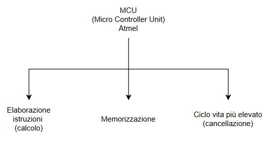

# ARDUINO 
## Due definizioni:
 - Scheda open source-hardware accompagnata da software, che permette la creazione semplificata 
 di prototipi destinati a **progetti inerattivi**, soprattutto in ambito **IOT**. 
 Dove è previsto l'uso di sensori di vario tipo;
 - Un progetto e una comunità di utenti che progetta e produce microcontrollori e 
 kit di microcontrollori a scheda singola per la costruzione di dispositivi
 digitali e oggetti interattivi in grado di rilevare e controllare oggetti nel mondo fisico e 
 digitale.

 Erroneamente si è portati a pensare che il microcontrollore sia una sorta di processore limitato 
 oppure un mezzo antenato dei più moderni microprocessori, in realtà è un'**evoluzione alternativa** al 
 microprocessore con capacità molto diverse:
 

 ### Link interessanti:

  - https://vimeo.com/131660496
  - https://youtu.be/xFsFJz4LAkE
  - https://www.digitalic.it/hardware-software/arduino
